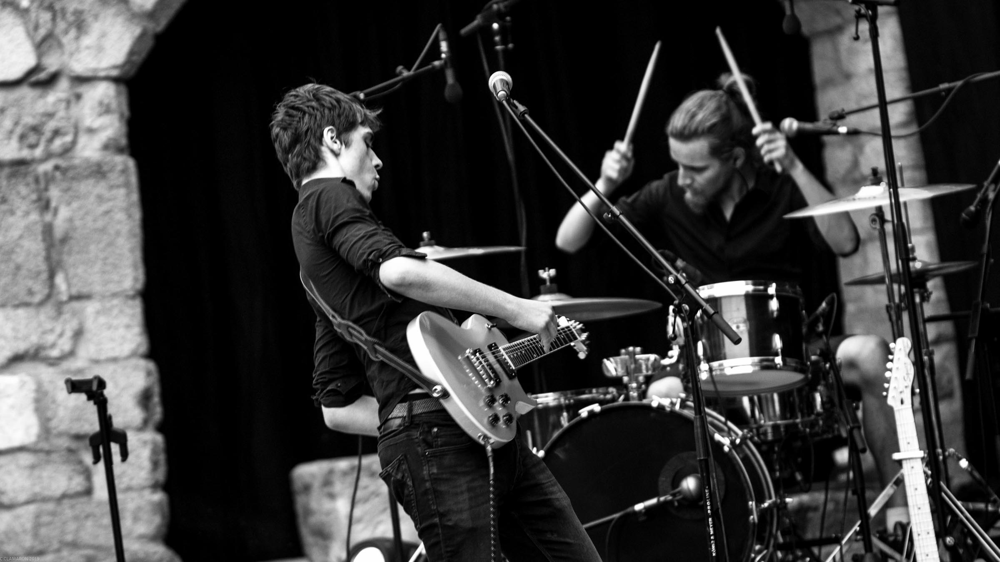

  

    <h1>Titre h1</h1>
    <h2>Titre h2</h2>
    <h3>Titre h3</h3>
    <h4>Titre h4</h4>
    <h5>Titre h5</h5>
  

  

    

    

    

    

    

  

  <a href="" class="inline-block text-lg uppercase px-6 py-2 text-white hover:text-white bg-red hover:bg-red-light border-2 border-red hover:border-red-light shadow-xl rounded font-bold tracking-wide">
    <svg xmlns="http://www.w3.org/2000/svg" class="inline h-6 w-6 -mt-1" fill="none" viewBox="0 0 24 24" stroke="currentColor">
      <path stroke-linecap="round" stroke-linejoin="round" stroke-width="2" d="M14.752 11.168l-3.197-2.132A1 1 0 0010 9.87v4.263a1 1 0 001.555.832l3.197-2.132a1 1 0 000-1.664z" />
      <path stroke-linecap="round" stroke-linejoin="round" stroke-width="2" d="M21 12a9 9 0 11-18 0 9 9 0 0118 0z" />
    </svg>
    Watch
  </a>
  <a href="https://hypeddit.com/link/r3oq6j" class="inline-block text-lg uppercase px-6 py-2 bg-white border-2 border-red hover:border-red-light shadow-xl rounded font-bold tracking-wide">
    <svg xmlns="http://www.w3.org/2000/svg" class="inline h-6 w-6 -mt-1" fill="none" viewBox="0 0 24 24" stroke="currentColor">
      <path stroke-linecap="round" stroke-linejoin="round" stroke-width="2" d="M9 19V6l12-3v13M9 19c0 1.105-1.343 2-3 2s-3-.895-3-2 1.343-2 3-2 3 .895 3 2zm12-3c0 1.105-1.343 2-3 2s-3-.895-3-2 1.343-2 3-2 3 .895 3 2zM9 10l12-3" />
    </svg>
    Listen
  </a>

  

    

      

        
      

      

        

          “At that time, I was looking for a band to play gigs, my own band was slowing down, and wasn’t touring as much as I wanted to.
          We didn’t know each other very well, as we only met through social media, so we decided to take time to jam a bit, each proposing a song to cover, testing the alchemy. We realized that we easily played together, so we started writing our own stuff, and that led to our first EP.
          My former band was more instinctive, each one bringing their ideas, we didn’t have any leader, without implying that there’s one now, we wouldn’t take time to work deeply on our songs, to re-arrange, to focus on an artistic direction.
        

        

          But this is how KNTC works: we take our time, we try a lot of things, coming from one simple idea, we don’t stick to the first draft, usually, it’s only a flick, pushing us in the right direction. That’s what I thought was interesting.”
        

      

    

    

      

        
      

      

        

          “At that time, I was looking for a band to play gigs, my own band was slowing down, and wasn’t touring as much as I wanted to.
          We didn’t know each other very well, as we only met through social media, so we decided to take time to jam a bit, each proposing a song to cover, testing the alchemy. We realized that we easily played together, so we started writing our own stuff, and that led to our first EP.
          My former band was more instinctive, each one bringing their ideas, we didn’t have any leader, without implying that there’s one now, we wouldn’t take time to work deeply on our songs, to re-arrange, to focus on an artistic direction.
        

        

          But this is how KNTC works: we take our time, we try a lot of things, coming from one simple idea, we don’t stick to the first draft, usually, it’s only a flick, pushing us in the right direction. That’s what I thought was interesting.”
        

      

    

    

      

        
      

      

        

          “At that time, I was looking for a band to play gigs, my own band was slowing down, and wasn’t touring as much as I wanted to.
          We didn’t know each other very well, as we only met through social media, so we decided to take time to jam a bit, each proposing a song to cover, testing the alchemy. We realized that we easily played together, so we started writing our own stuff, and that led to our first EP.
          My former band was more instinctive, each one bringing their ideas, we didn’t have any leader, without implying that there’s one now, we wouldn’t take time to work deeply on our songs, to re-arrange, to focus on an artistic direction.
        

        

          But this is how KNTC works: we take our time, we try a lot of things, coming from one simple idea, we don’t stick to the first draft, usually, it’s only a flick, pushing us in the right direction. That’s what I thought was interesting.”
        

      

    

  

